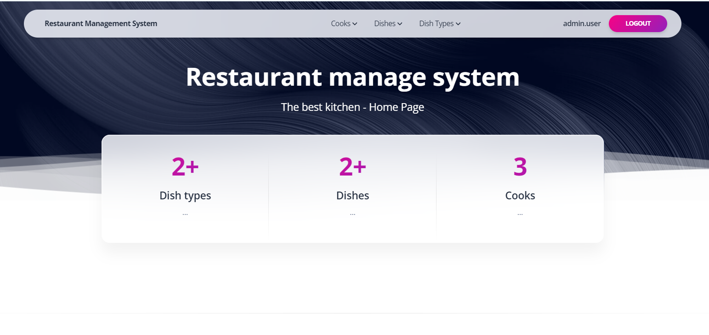

# py-resto-management
# 🍽️ Restaurant Management System

A web application built with **Django** for managing a restaurant's internal processes — dishes, dish types, and cooks.

## 🔭 Check it out!

[Resto Management project deployed to Render](https://resto-mfux.onrender.com/)

---

## 🚀 Project Overview

**Restaurant Management System** allows restaurant administrators to easily manage:
- Dishes and their details (name, description, price, dish type)
- Dish categories (types of dishes)
- Cooks (with experience years and assigned dishes)

The app is designed with an interface using the **Soft UI Design System** from Creative Tim, and it follows Django best practices for modular and secure development.

---

## 🧩 Features

✅ Authentication system (login/logout, admin panel)  
✅ Manage cooks, dishes, and dish types (CRUD operations)  
✅ Search functionality for cooks and dishes  
✅ Responsive design with Soft UI theme  
✅ Secure configuration via `.env` file  
✅ Django ORM

---

## 🛠️ Tech Stack

| Layer | Technology |
|-------|-------------|
| Backend | Django 5, Python 3.13 |
| Frontend | HTML, CSS, JS (Soft UI Design System) |
| Database | PostgreSQL / SQLite |
| Auth | Django built-in authentication |
| Environment | `python-dotenv`, `.env` configuration |
| Forms | `django-crispy-forms` |

---

## ⚙️ Installing

Python3 must be already installed 

* git clone https://github.com/Luchnick112/py-resto-management 
* cd py-resto-management 
* python3 -m venv venv 
* source venv/bin/activate 
* pip install -r requirements.txt 
* python manage.py runserver  # starts Django Server

---

## 🖥  Demo

